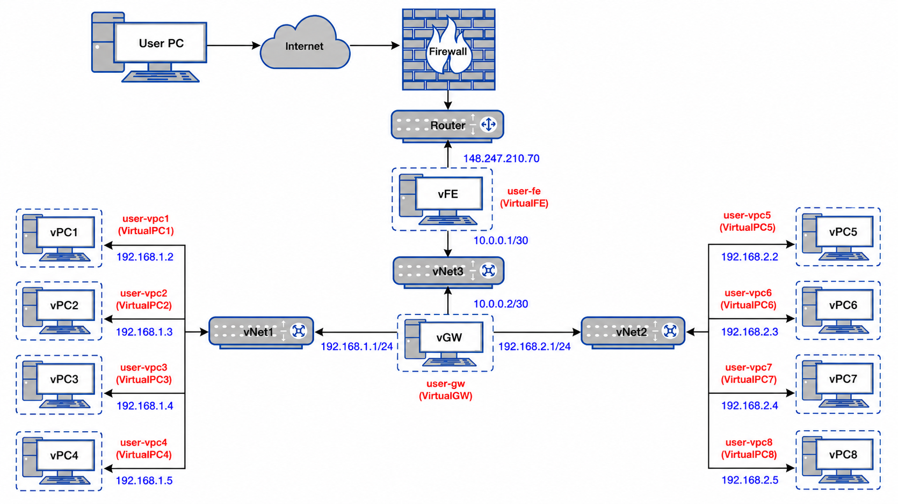
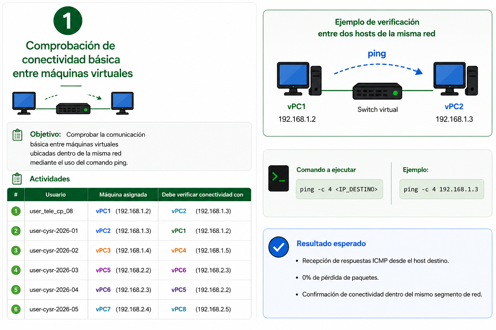
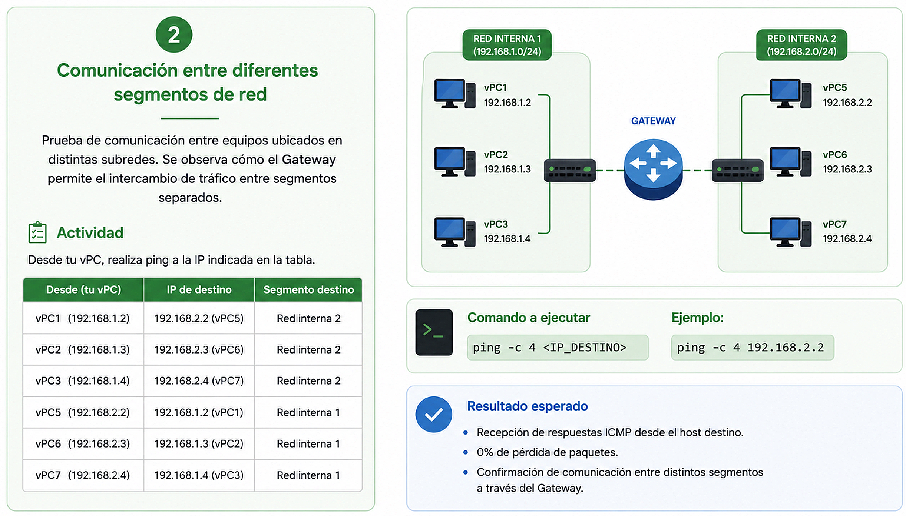
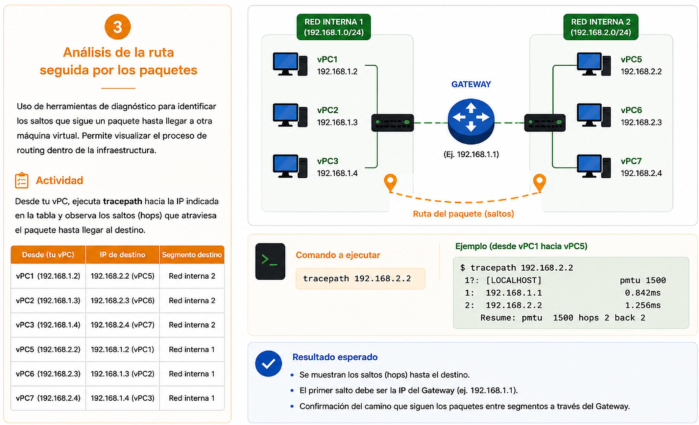
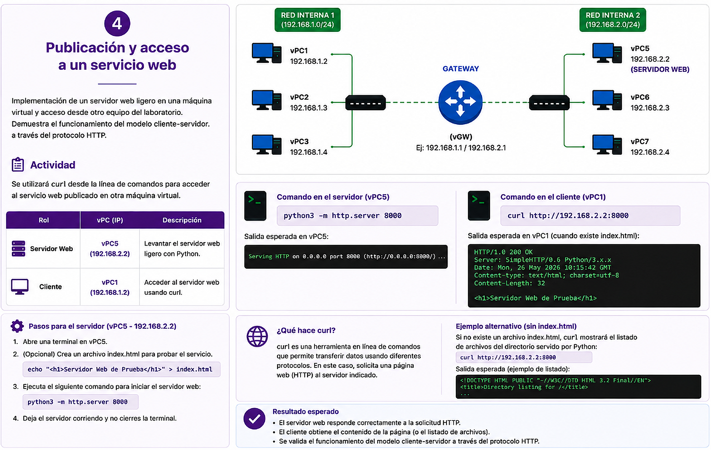
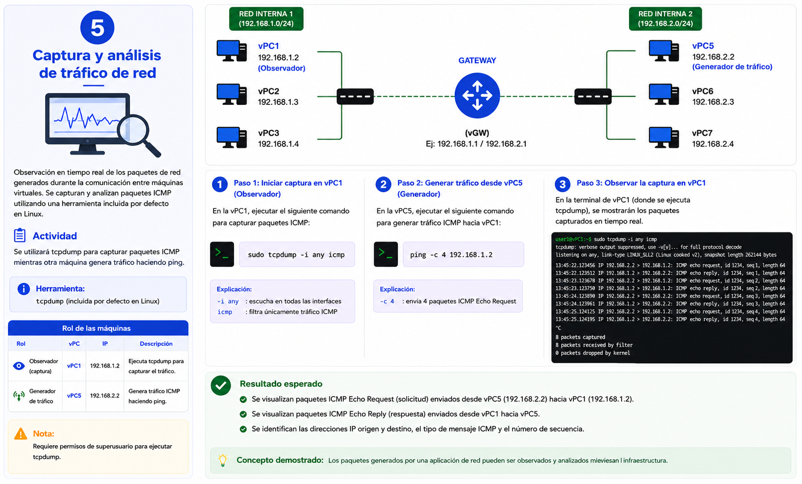
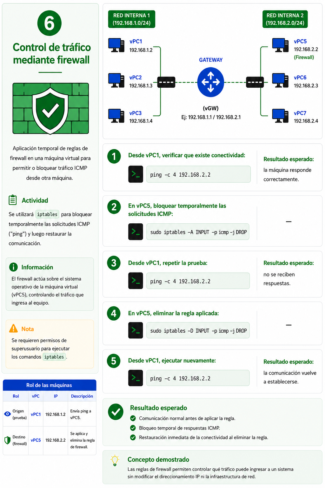
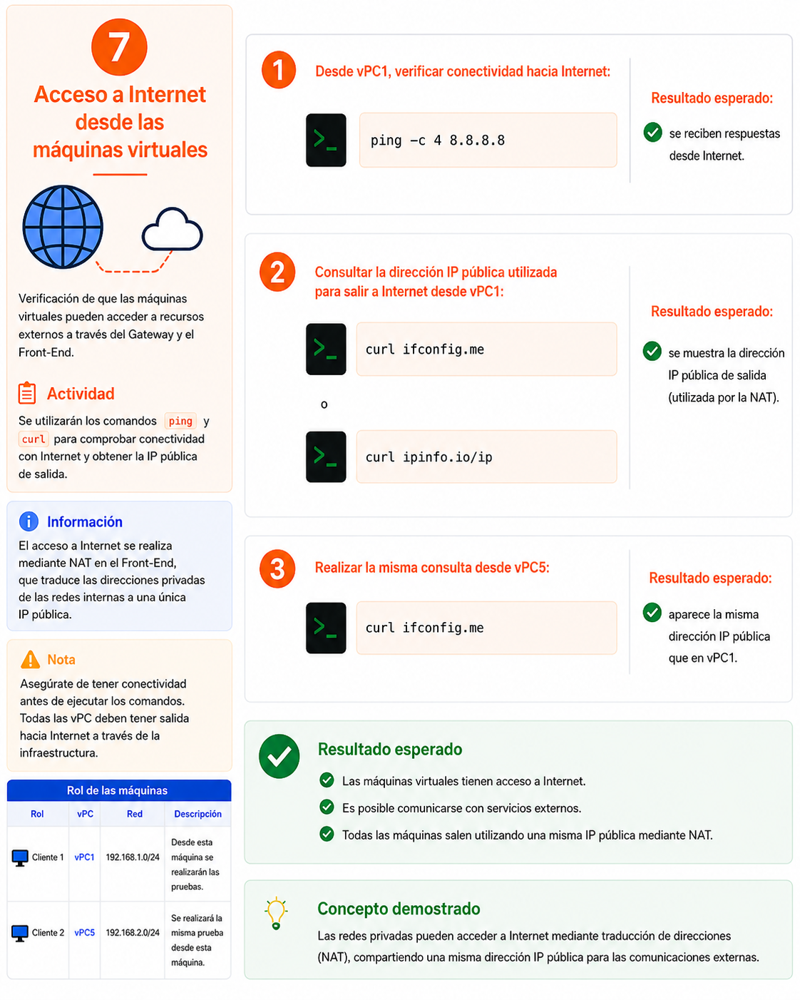
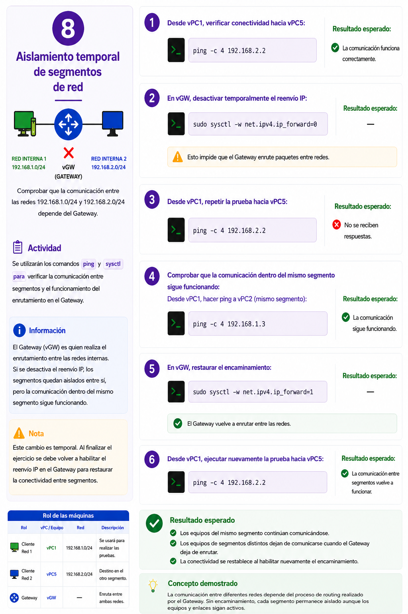

# Guía de acceso al laboratorio virtual

Esta guía te explica cómo conectarte a tu máquina virtual asignada desde cualquier lugar con acceso a internet.

---

## Arquitectura del laboratorio

El siguiente diagrama muestra cómo está organizada la red del laboratorio. Tu computadora se conecta al servidor de acceso (vFE) a través de internet, y desde ahí puedes saltar a la máquina virtual que te fue asignada.



---

## ¿Qué necesitas?

- Una computadora con acceso a internet
- Un cliente SSH:
  - **Windows:** [PuTTY](https://www.putty.org/) o la aplicación **Terminal** (Windows 10/11)
  - **Mac / Linux:** la aplicación **Terminal** que ya viene instalada
- Tu usuario y contraseña (proporcionados previamente)

---

## Paso 1 — Conectarse al servidor de acceso

Abre una terminal y escribe el siguiente comando, reemplazando `tu_usuario` con el nombre de usuario que te fue asignado:

```
ssh tu_usuario@148.247.210.70
```

Te pedirá tu contraseña. Escríbela y presiona Enter.

> Si es la primera vez que te conectas, aparecerá un mensaje preguntando si confías en el servidor. Escribe `yes` y presiona Enter.

---

## Paso 2 — Saltar a tu máquina virtual

Una vez dentro del servidor de acceso, conéctate a la máquina virtual que te fue asignada con el mismo comando:

```
ssh tu_usuario@192.168.X.X
```

Sustituye `192.168.X.X` con la dirección IP que te indicó el administrador.

Te pedirá tu contraseña nuevamente. Una vez que ingreses, ya estás dentro de tu máquina virtual.

---

## Acceso a internet desde tu máquina virtual

Tu máquina virtual tiene acceso a internet. Puedes navegar, descargar paquetes o hacer consultas desde la terminal normalmente.

El tráfico de tu máquina sale a internet de forma compartida a través del servidor del laboratorio, por lo que la dirección IP pública que verán los sitios externos será la del laboratorio, no la de tu computadora personal.

---

## Resumen del flujo de conexión

```
Tu computadora  →  Servidor de acceso (148.247.210.70)  →  Tu máquina virtual
```

---

## Ejercicios prácticos

Una vez que estés dentro de tu máquina virtual asignada, puedes realizar los siguientes ejercicios. Cada uno está diseñado para explorar distintos aspectos de la red del laboratorio.

---

### Ejercicio 1 — Comunicación básica entre máquinas virtuales



---

### Ejercicio 2 — Comunicación entre diferentes segmentos de red



---

### Ejercicio 3 — Análisis de la ruta de los paquetes



---

### Ejercicio 4 — Publicación y acceso a un servicio web



---


### Ejercicio 5 — Captura y análisis de tráfico de red



---

### Ejercicio 6 — Control de tráfico mediante firewall



---


### Ejercicio 7 — Acceso a internet desde las máquinas virtuales



---

### Ejercicio 8 — Aislamiento temporal de segmentos de red



---

## Preguntas frecuentes

**¿Olvidé mi contraseña, qué hago?**
Contacta al administrador del laboratorio para que la restablezca.

**¿Puedo conectarme desde cualquier red?**
Sí, siempre que tengas acceso a internet puedes conectarte desde casa, trabajo o cualquier red.

**¿Qué pasa si cierro la terminal?**
La sesión se cierra. Al volver a conectarte simplemente repite los pasos 1 y 2.

**¿Puedo abrir varias sesiones al mismo tiempo?**
Sí, puedes abrir varias ventanas de terminal y conectarte simultáneamente.
